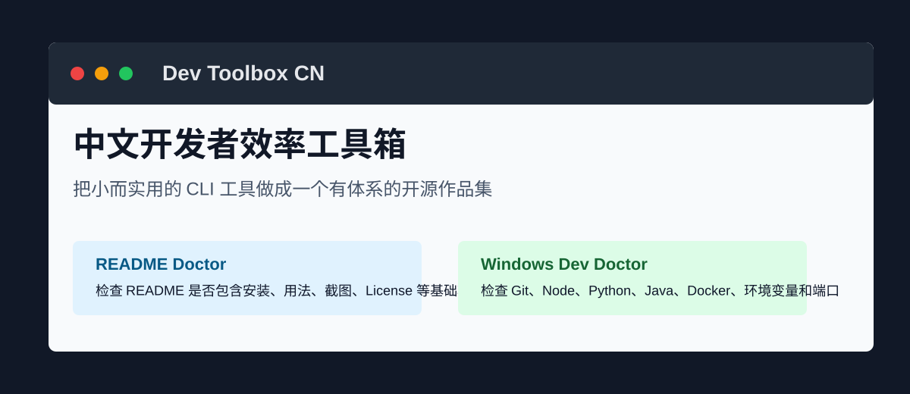

# Dev Toolbox CN

[](https://github.com/yunxi067/dev-toolbox-cn/actions/workflows/test.yml)
[](./LICENSE)

Dev Toolbox CN 是一个中文开发者效率工具箱主页，用来汇总和规划一组“小而实用”的开源 CLI 工具。它不是一个大而全的平台，而是一组能解决真实开发痛点、能被 `npx` 运行、能在 GitHub 上持续维护的小工具集合。



## 当前工具

| 工具 | 状态 | 解决的问题 | 仓库 | Release |
| --- | --- | --- | --- | --- |
| README Doctor | v0.1.0 + Unreleased | 检查 GitHub 或本地 README 是否包含安装、使用示例、截图、License、贡献方式和 FAQ | [readme-doctor](https://github.com/yunxi067/readme-doctor) | [v0.1.0](https://github.com/yunxi067/readme-doctor/releases/tag/v0.1.0) |
| Windows Dev Doctor | v0.1.0 + Unreleased | 检查 Windows 开发环境里的工具链、环境变量、配置、隐私输出和端口占用 | [windows-dev-doctor](https://github.com/yunxi067/windows-dev-doctor) | [v0.1.0](https://github.com/yunxi067/windows-dev-doctor/releases/tag/v0.1.0) |

## 快速使用

> npm 包已经准备好发布元数据。若 npm 尚未发布，可先从 GitHub Release 下载 tarball 或 clone 仓库运行。

```bash
npx @yunxi067/readme-doctor owner/repo
npx @yunxi067/windows-dev-doctor
```

本地运行：

```bash
git clone https://github.com/yunxi067/readme-doctor.git
cd readme-doctor
npm install
npm start -- owner/repo
node src/cli.js ./README.md --format markdown
```

```bash
git clone https://github.com/yunxi067/windows-dev-doctor.git
cd windows-dev-doctor
npm install
npm start
node src/cli.js --privacy --fix-plan
```

## 为什么做这个工具箱

- 中文开发者常见痛点不是“缺一个巨型平台”，而是缺一组开箱即用的小工具。
- CLI 工具容易安装、容易验证、容易写测试，也适合持续迭代。
- 每个工具都要能独立运行、独立发布、独立讲清楚价值。
- 总入口仓库负责组织路线图、展示工具关系和沉淀维护规范。

## 项目原则

- **小而完整**：每个工具只解决一个清晰问题，但 README、测试、Release、License 都要齐。
- **中文优先**：面向中文开发者，文档和修复建议尽量使用中文。
- **零依赖优先**：能用 Node.js 标准库解决时，不引入额外依赖。
- **可验证优先**：每个工具至少有自动测试、真实运行示例和 Release。
- **不做危险自动修复**：诊断工具默认只读，不随意修改系统或仓库。

## 工具路线图

详见 [docs/roadmap.md](./docs/roadmap.md)。

近期进度：

- README Doctor 已补充 v0.2.0 预备能力：本地 README 文件、中文 README 规则、Markdown 报告。
- Windows Dev Doctor 已补充 v0.2.0 预备能力：WSL、PowerShell 执行策略、pnpm/yarn、Maven/Gradle、npm/pip 镜像源、隐私模式、修复计划。
- 新工具候选：日志压缩器、项目结构快照器、Commit Message 检查器。

## 仓库结构

```text
.
├── assets/
│   └── hero.svg
├── docs/
│   ├── roadmap.md
│   ├── tool-matrix.md
│   └── release-playbook.md
├── scripts/
│   └── validate.mjs
├── README.md
├── CONTRIBUTING.md
├── CODE_OF_CONDUCT.md
├── SECURITY.md
└── LICENSE
```

## 维护清单

每新增一个工具，至少补齐：

- 中文 README
- `npm test`
- GitHub Actions
- MIT License
- CHANGELOG
- GitHub Release
- 真实运行示例
- 工具箱主页入口

## 参与贡献

欢迎提交 issue 或 pull request。请先阅读 [CONTRIBUTING.md](./CONTRIBUTING.md)。

## License

MIT
